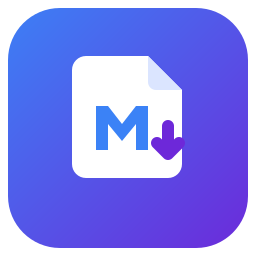

<div align="center">



# File to Markdown Converter

**A native Windows app that batch-converts documents, images and scanned PDFs into Markdown — fully offline.**

[](../../actions/workflows/build-and-test.yml)
[](../../actions/workflows/release.yml)
[](LICENSE)

</div>

---

> ### ⚠️ This app is **completely vibe coded using Claude**. So the risk is yours!
> This is just a fun side project by a **non-programmer**. There are no guarantees — review the code and use at your own risk.

---

Built on Microsoft's [markitdown](https://github.com/microsoft/markitdown) conversion engine, with real OCR instead of markitdown's LLM-based image description — no cloud, no API keys.

## ✨ What it does

- **Batch convert** a queue of files (or whole folders) to `.md` — drag & drop, file picker, or folder picker.
- **Documents** → PDF, Word, PowerPoint, Excel, HTML, CSV/JSON/XML, EPub, Outlook `.msg`, ZIP (via markitdown).
- **Images** (PNG/JPG/TIFF/BMP/GIF/WEBP) → text extracted with OCR.
- **PDFs — smart per-page pipeline.** Every page is analyzed individually: pages with a real digital text layer keep their extracted text; scanned pages are OCR'd — even in documents where scans carry machine-typed page numbers (which used to fool whole-file detection). Nothing is dropped, nothing is doubled.
- **Choice of OCR engine:** built-in **Tesseract** (fast, offline, default) or **Surya** (transformer models with much better table/layout understanding — one-time ~2 GB on-demand download).
- **Enhanced PDF OCR (optional):** installs [OCRmyPDF](https://ocrmypdf.readthedocs.io/) + Tesseract CLI + Ghostscript on demand; PDFs then get a proper invisible text layer via `--redo-ocr`, and you can **save a searchable PDF** (`name.ocr.pdf`) next to the Markdown.
- **Audio & YouTube** → transcription via markitdown (these need internet).
- **Auto-updates** from GitHub Releases — checked at startup (daily) and on demand, with SHA-256 verification.
- **Warm greige design system** with Light / Dark / System themes, Mica backdrop, configurable concurrency, OCR DPI, and overwrite policy.

## 📦 Download & install

Grab the latest build from the [**Releases**](../../releases) page:

| Artifact | What it is |
|---|---|
| `FileToMarkdownConverter-Setup.exe` | Recommended — friendly installer with Start Menu/desktop shortcuts and **auto-update support**. |
| `FileToMarkdownConverter-portable-x64.zip` | Portable — unzip anywhere and run `FileToMarkdown.App.exe`. No install. |
| `FileToMarkdownConverter.msi` | MSI installer (WiX), for scripted/enterprise installs. |
| `SHA256SUMS.txt` | Checksums for all artifacts (verified by the in-app updater). |

All artifacts are **self-contained** — no need to install .NET, the Windows App SDK, or Python. The Python 3.13 runtime, markitdown, ffmpeg, and Tesseract data are bundled inside.

> A true single-file `.exe` isn't possible here: WinUI 3 + native PDFium/Tesseract libraries + the embedded Python bundle can't be packed into one file. "Portable" means an xcopy-deployable folder you launch by its `.exe`.

## 🔄 How updates work

- The app checks GitHub Releases **every time it starts** (and via **Settings → Check for updates**); versions you choose to skip stay skipped.
- Setup.exe installs update in place after you confirm; downloads are verified against `SHA256SUMS.txt`. MSI/portable users are pointed to the release page instead.
- **Bundled tools stay fresh too:** markitdown & friends are pinned in `tools/versions.json`; a weekly workflow opens a bump PR when new versions ship, so every release carries current tools to users.

## 🧠 How it works

| Project | Role |
|---|---|
| `FileToMarkdown.App` | WinUI 3 shell — MVVM (CommunityToolkit) + DI, greige theme tokens, updater UI. |
| `FileToMarkdown.Core` | Conversion engine — routing, per-page PDF pipeline, OCR engines, update logic. |

- A **persistent Python worker** (`tools/worker.py`) imports markitdown once and converts files over a stdin/stdout protocol, so a batch doesn't pay interpreter startup per file. Surya runs the same way (`tools/surya_worker.py`).
- **Per-page PDF routing:** PDFium reports each page's text and its area coverage; a classifier separates truly digital pages from scans stamped with page numbers. Digital pages are extracted with pdfminer, scanned pages rasterized and OCR'd, and the sparse stamped text is merged back in without duplication. Fully digital documents go to markitdown whole.
- **Why a bundled Python 3.13?** markitdown doesn't install on Python 3.14 yet (its `magika` → `onnxruntime` dependency has no 3.14 wheels). The app ships its own private 3.13 so it works regardless of what's on your machine.

## 🔁 Build from source

**Prerequisites:** Windows 10/11 (x64), [.NET SDK 9+](https://dotnet.microsoft.com/download). For installers: Inno Setup (`winget install JRSoftware.InnoSetup`) and WiX v5 (`dotnet tool install --global wix --version 5.0.2`).

```powershell
# 1. Clone
git clone https://github.com/kartikeya-prasad/File-to-Markdown-Converter.git
cd File-to-Markdown-Converter

# 2. Fetch the bundled runtime (Python 3.13 + markitdown + ffmpeg + Tesseract data).
#    Large (~hundreds of MB) and intentionally NOT committed; versions are pinned in tools\versions.json.
powershell -File tools\setup-python.ps1

# 3. Build & test
dotnet build FileToMarkdown.sln -c Debug -p:Platform=x64
dotnet test tests\FileToMarkdown.Core.Tests -c Debug -p:Platform=x64

# 4. (optional) Produce distributables into dist\
powershell -File tools\build-portable.ps1        # portable .zip (run first; stages the publish folder)
powershell -File tools\build-exe-installer.ps1   # -> FileToMarkdownConverter-Setup.exe
powershell -File tools\build-msi.ps1             # -> FileToMarkdownConverter.msi
```

The app locates its runtime (`python\`, `tessdata\`) by walking up from the executable, so a debug build works in place once `setup-python.ps1` has run.

> **Automated releases:** pushing a version tag (e.g. `git tag v0.3.0 && git push origin v0.3.0`) runs the `Build & Release` workflow, which builds all three distributables on a clean Windows runner, generates `SHA256SUMS.txt`, and publishes a GitHub Release whose notes combine the curated `CHANGELOG.md` section with auto-generated commit notes. Every push/PR is validated by the `Build & Test` workflow.

## 🤝 Contributing

See [CONTRIBUTING.md](CONTRIBUTING.md) — conventional commits, test conventions, and how CI acts as the compiler if you don't have a Windows machine.

## ⚠️ Known limitations

- **Audio transcription** is best-effort (markitdown's backend may need internet/extra setup).
- **YouTube** conversion needs internet (transcript API).
- First run after cloning requires `setup-python.ps1` (downloads the runtime).
- x64 only. Artifacts are currently unsigned (SmartScreen may warn on first run).

## 📄 License

[MIT](LICENSE). Bundles third-party components under their own licenses: markitdown (MIT), PDFium (BSD), Tesseract (Apache-2.0), ffmpeg (LGPL/GPL), Python (PSF). Optional on-demand components: Surya (GPL-3.0, installed from PyPI), OCRmyPDF (MPL-2.0), Ghostscript (AGPL-3.0, downloaded from Artifex's official releases — never redistributed with this app).

## 📝 Changelog

See [CHANGELOG.md](CHANGELOG.md) or the [Releases](../../releases) page.
